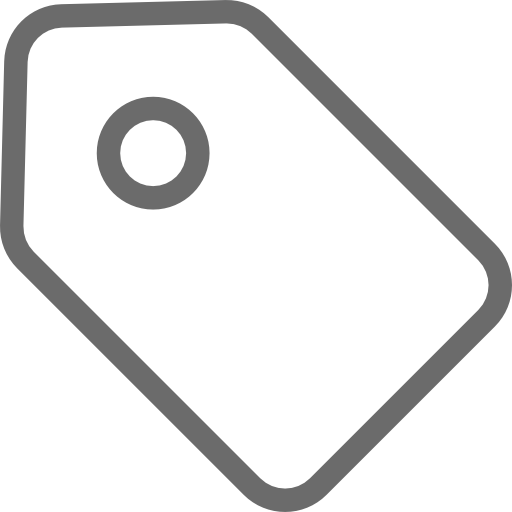

<a href="https://codecheck.org.uk/"></a>

# <a href="https://codecheck.org.uk/"></a>  ojs-codecheck

[](https://www.repostatus.org/#wip)
[](https://opensource.org/licenses/Apache-2.0)
[](https://github.com/codecheckers/ojs-codecheck/blob/main/CONTRIBUTING.md)
[](https://github.com/codecheckers/ojs-codecheck/actions/workflows/tests.yml)
<br />

An [OJS Plugin](https://docs.pkp.sfu.ca/dev/plugin-guide/en/) to streamline codechecking of submissions and display of [CODECHECK](https://codecheck.org.uk/) certificates.

## About

This plugin integrates the [CODECHECK](https://codecheck.org.uk/) process into the submission and review workflows within Open Journal Systems ([OJS](https://pkp.sfu.ca/software/ojs/)), allowing journals to streamline code and computational reproducibility checking of scholarly submissions. The plugin provides tools for metadata creation and certificate deposition, displaying certificates, ensuring computational transparency in published research, as well as certificate and metadata publication. Therefore the plugin connects seamlessly with the CODECHECK infrastructure.

The ojs-codecheck plugin development was started as part of the [CHECK-PUB](https://codecheck.org.uk/pub/) project with support from TU Delft Library.

## Features

- **Submission integration**: Seamless integration with the OJS submission and review workflow
- **CODECHECK metadata**: Built-in tools for creation and publication of CODECHECK metadata
<!--
- **Certificate Creation**: Built-in workflow to create CODECHECK certificates from metadata
- **Certificate Verification**: Built-in tools for verifying CODECHECK certificates
-->
- **Certificate display**: Automatically display CODECHECK certificates for verified submissions
- **Customizable settings**: Configure CODECHECK workflow and display preferences

## Installation

1. Download the plugin from the [releases page](https://github.com/codecheckers/ojs-codecheck/releases) or clone the repository
2. Extract the plugin to your OJS `plugins/generic/` directory
3. Navigate to **Settings → Website → Plugins** in your OJS admin panel
4. Find "CODECHECK" and click **Enable**
5. Configure the plugin settings as needed

## Changelog

If you are interested in the changes made to this project and the different versions, feel free to view the projects [Changelog](CHANGELOG.md).

### Version compatibility

The `1.y.z` versions of this plugin are compatible with OJS `3.5.x`.

For the full features of each version, feel free to look into the [Changelog](#changelog).

| Plugin Version | OJS Version | Status             |
|----------------|-------------|--------------------|
| `Unreleased`   | `3.5.0+`    | Active Development |
| `1.y.z`        | `3.5.0+`    | Active Development |

## Color scheme

This plugin follows the CODECHECK brand guidelines and integrates with OJS design patterns.

### Primary colors

| Color | Hex Code | Usage | Source |
|-------|----------|-------|---------|
| **CODECHECK Main Green** | `#008033` | Primary brand color, certificates, badges | [CODECHECK brand](https://github.com/codecheckers/codecheckers.github.io#logo-and-badge) |
| **CODECHECK Dark Green** | `#006629` | Hover states, borders, emphasis | Derived from main green (80% brightness) |
| **CODECHECK Light Green** | `#e8f5e8` | Certificate backgrounds, success states | Derived from main green (95% lightness) |

### Secondary Colors

| Color | Hex Code | Usage | Source |
|-------|----------|-------|---------|
| **Info Background** | `#d1ecf1` | Information boxes, notices | Bootstrap info (OJS compatibility) |
| **Info Border** | `#d4edda` | Information box borders | Bootstrap info (OJS compatibility) |
| **Info Text** | `#0c5460` | Information text, labels | Bootstrap info (OJS compatibility) |
| **Details Text** | `#495057` | Secondary text, descriptions | Bootstrap neutral (OJS compatibility) |
| **Form Borders** | `#ced4da` | Input borders, form elements | Bootstrap neutral (OJS compatibility) |
| **Background Light** | `#f8fff9` to `#e8f5e8` | Light backgrounds, certificate gradients | Custom light green variants |

### Color usage guidelines

- **Primary Green (`#008033`)**: Use for all CODECHECK-specific elements (certificates, badges, primary actions)
- **Secondary Colors**: Use for supporting UI elements that need to integrate with OJS design
- **Gradients**: Combine primary green variants for certificate backgrounds and special elements
- **Accessibility**: All color combinations meet WCAG 2.1 AA contrast requirements

## Usage

### For codecheckers

1. **Metadata creation**: Assistance for creating a CODECHECK metadata file `codecheck.yml`
1. **Metadata import**: If `codecheck.yml` already exists, you can also use it instead
1. **Manage CODECHECKs**: The plugin enables you to manage your different ongoing CODECHECK tasks

### For journal managers and editors

1. **Manage the plugin**: Activate through the plugin management interface and set up display preferences and workflow options
1. **Workflow integration**: The plugin automatically integrates with your submission workflow
1. **Monitor certificates**: View and manage CODECHECK certificates through the admin interface

### For authors

1. **CODECHECK Process**: Work with codecheckers to verify your computational work
1. **Certificate Integration**: Certificates are automatically displayed once verification is complete

### For Readers

1. **View certificates**: Explore CODECHECK certificates on published articles
1. **Access materials**: Links to computational materials and repositories

## CODECHECK Status System

The plugin tracks CODECHECK progress through a status system displayed in the review workflow.

### Status Levels

| Status | Badge Color | Criteria | Description |
|--------|------------|----------|-------------|
| **Pending** | Gray | No metadata exists | CODECHECK process has not started |
| **In Progress** | Yellow/Warning | Metadata exists but incomplete | Codechecker is working on verification |
| **Complete** | Green/Success | Certificate ID and check time both present | CODECHECK verification is finished |

### Status Implementation

The status is determined in `CodecheckReviewDisplay.vue` using the following logic:

```javascript
function getStatus() {
  if (metadata.value.certificate && metadata.value.checkTime) {
    return 'complete';
  } else if (hasMetadata.value) {
    return 'in-progress';
  }
  return 'pending';
}
```

## Development

### Requirements

- OJS 3.5.0 or later
- PHP 8.2.0 or later
- Node.js 18+ (for frontend development)
- npm
- Composer

### Install dependencies

```bash
composer install
npm install
npm run build
```

**All three are required to run the plugin**, not just to develop it:

- `composer install` creates `vendor/`, which several classes load at file scope.
  Without it, any request reaching the CODECHECK API fails.
- `npm run build` creates `public/build/build.iife.js` and `public/build/build.css`,
  which the plugin loads into the OJS backend. `public/` is **not in git**, so after
  a fresh clone the CODECHECK UI is missing until you build. Re-run after every
  change under `resources/js/`.

### Frontend Development

This plugin uses **Vite** for building Vue.js components.

```bash
npm run build     # production build into public/build/
npm run watch     # rebuild on file changes
```

The bundle is an IIFE library that expects OJS's own globals (`pkp.registry`,
`pkp.modules.vue`) to exist — it registers components into the OJS Vue app rather
than mounting its own. It therefore cannot be exercised standalone; the Cypress
component tests substitute a mock `pkp` global.

`registry/uiLocaleKeysBackend.json` is **generated** during the build from the
`t('…')` calls in the Vue sources. Do not edit it by hand; add the key to
`locale/en/locale.po` and rebuild.

### Frontend Structure
```bash
├── resources/
│   └── js/
│       ├── Components/*    # Vue 3 components
│       └── main.js         # Entry point
├── css/*                   # Minimal plugin CSS stylesheets
└── public/
    └── build/              # Compiled assets (generated by Vite)
        ├── build.iife.js
        └── build.css
```

### Local development environment

The plugin is developed in a standalone checkout and linked into an OJS
installation that sits next to it. A `Makefile` automates the whole setup —
run `make help` for the full list of targets.

#### One-off database grant

The setup uses a MySQL/MariaDB account named `ojs`. Because MySQL root normally
authenticates via `unix_socket`, this one step needs a root shell (`sudo mysql`)
and only has to be done once:

```sql
CREATE USER IF NOT EXISTS 'ojs'@'localhost' IDENTIFIED BY 'ojs';
CREATE DATABASE IF NOT EXISTS ojs_codecheck_350
  CHARACTER SET utf8mb4 COLLATE utf8mb4_unicode_ci;
GRANT ALL PRIVILEGES ON ojs_codecheck_350.* TO 'ojs'@'localhost';
FLUSH PRIVILEGES;
```

Everything after this uses only the `ojs` account.

#### Bring-up

```bash
make ojs-install    # download OJS into ../ojs-350 and add its dev dependencies
make setup          # plugin deps + build, link into OJS, write config, load test data
make serve          # http://localhost:8350 — admin / admin
```

`make setup` links this checkout to `../ojs-350/plugins/generic/codecheck`, so
edits are live on the dev server with no copying. It also generates the OJS
`app_key` (3.5 refuses to serve any page without one), repairs the test
dataset's schema, and clears the caches OJS keeps for plugin settings.

The seeded journal is at <http://localhost:8350/index.php/codecheck>. See
[testData/README.md](testData/README.md) for the accounts and content it contains.

Useful targets:

| Target | Does |
|---|---|
| `make db-load` | load the test dataset |
| `make db-reset` | drop, recreate and reload from scratch |
| `make build` / `make watch` | rebuild the Vue bundle |
| `make test` | component tests + PHPUnit |
| `make screenshots` | capture every plugin UI surface to `cypress/ui-screenshots/` |
| `make inspect URL=…` | open one page and dump screenshot, HTML and console log |

Any value can be overridden, e.g. `make serve PORT=9000` or
`make setup OJS_ROOT=/path/to/other/ojs`.

#### Inspecting the UI without a browser

`make screenshots` runs a Cypress pass over the plugin settings form, the
editorial dashboard column, the workflow CODECHECK tab, the published article
sidebar, an issue table of contents and the info page, writing full-page PNGs to
`cypress/ui-screenshots/`.

Captures are 1920x1200; change that with
`make screenshots SHOT_WIDTH=2560 SHOT_HEIGHT=1440`.

For a single page, `dev/inspect.mjs` logs in and dumps a screenshot, the rendered
HTML and the console/network log (including failed requests) to `dev/out/`:

```bash
make inspect URL=http://localhost:8350/index.php/codecheck/dashboard/editorial
node dev/inspect.mjs <url> --selector '.codecheck-metadata-form' --headed
```

Both need `make serve` running in another terminal.

### Creating a Release

1. Checkout to a new Release branch
    - `git checkout -b "release-x_y_z-0"` (see [CHANGELOG.md](https://github.com/codecheckers/ojs-codecheck/blob/main/CHANGELOG.md) for further information on the version names)
2. Change the release in the `version.xml` to the new version specified in the Release branch name
    - please use the full OJS format, so `x.y.z.0`
3. Install dependencies: `npm install`
4. Build the frontend: `npm run build`
5. Ensure that:
    - `public/build/` exists (**ignored by git**)
    - and contains the compiled files (`build.iife.js` and `build.css`)
6. [Test](https://github.com/codecheckers/ojs-codecheck/?tab=readme-ov-file#testing) the plugin ([Frontend Component Tests](https://github.com/codecheckers/ojs-codecheck/?tab=readme-ov-file#frontend-component-tests) and [PHP Unit Tests](https://github.com/codecheckers/ojs-codecheck/?tab=readme-ov-file#frontend-component-tests))
7. Create release tag
    - `git commit -am "Release x.y.z.0"`
    - `git tag -a vx.y.z.0 -m "Release x.y.z.0"`
8. Push the branch
    - `git push --set-upstream origin release-x_y_z-0`
9. Push the tag
    - `git push origin vx.y.z.0`
10. Package the Plugin: *(ensure that `vx.y.z.0` matches the tag you pushed)*
    - **manually**
        - as **`.zip`**:
          ```bash
          git archive --format=zip --output=codecheck-x.y.z.0.zip vx.y.z.0
          zip -r codecheck-x.y.z.0.zip public/
          zip -d codecheck-x.y.z.0.zip 'resources/*'
          ```
        - as **`.tar.gz`**:
          ```bash
          git archive --format=tar vx.y.z.0 > codecheck-x.y.z.0.tar
          tar -rf codecheck-x.y.z.0.tar public/
          tar --delete -f codecheck-x.y.z.0.tar resources
          gzip codecheck-x.y.z.0.tar
          ```
    - **via the `package-plugin.sh` script** *(recommended)*
      ```bash
      sh package-plugin.sh --format zip|tar.gz --version x.y.z.0
      ```
11. Double check that the package:
    - **Includes**: `public/build/`, all PHP files, templates, locale
    - **Doesn't include**: `node_modules/`, `vendor/`, `resources/` (source files), `.env`
12. Create the Release in the [GitHub UI](https://github.com/codecheckers/ojs-codecheck/releases/new)
    - **Tag [  ]:** make sure to select the tag, which you just created (`vx.y.z.0`)
    - **Target [  ]:** select your Release branch as a target (`"release-x_y_z-0"`)
    - **Title:** use both release number and a speaking title with terms like `"alpha"` or `"beta"` to communicate the development status
    - **Description:** detailed description on the new features and fixes, based on the entries from the [CHANGELOG.md](https://github.com/codecheckers/ojs-codecheck/blob/main/CHANGELOG.md)

### File Structure

```bash
codecheck/
├── CHANGELOG.md               # The projects Changelog with details for each version
├── CONTRIBUTING.md            # Contibution guidelines for this repo
├── CodecheckPlugin.php        # Main plugin class
├── LICENSE                    # License file
├── README.md                  # This documentation
├── api/*                      # API related classes (e.g. CodecheckApiHandler)
├── assets/*                   # Assets (e.g. images)
├── classes/*                  # Plugin classes
├── composer.json              # composer json-file
├── composer.lock              # composer lock-file
├── css/*                      # CODECHECK CSS stylesheets
├── cypress/                   # Frontend tests
│   ├── support/*              # mount helpers, pkp global mock, login commands
│   └── tests/
│       ├── component/*        # Vue component tests (no OJS needed)
│       ├── e2e/*              # end-to-end tests (need a running OJS)
│       └── visual/*           # screenshot pass over the plugin UI
├── dev/*                      # Development helpers (schema repair, page inspector)
├── locale/*                   # Internationalization (language localization strings)
├── Makefile                   # Local development environment automation
├── package-lock.json
├── package.json
├── package-plugin.sh          # Shell script, that makes packaging this plugin reproducible
├── public/build/*             # NPM realese build files
├── resources/js/*             # The Vue.js Components
├── templates/*                # HTML templates
├── tests/*                    # The ojs-codecheck plugin unit tests
├── version.xml                # Plugin metadata and version info
└── vite.config.js             # The config file for Vite.js

```

### Contributing

If you want to contribute to this project, we kindly ask you to follow our [contribution guidelines](CONTRIBUTING.md).

### Api

If you want to add a new Api Endpoint, please first register it inside the constructor of the CODECHECK Api Handler like this:

```php
$this->endpoints = [
  'Your method (e.g. GET, POST, ...)' => [
      [
          'route' => 'your endpoint route',
          'handler' => [$this, 'yourFunction'],
          'role' => CodecheckRole::class, // give the `'Role'` property a class that extends CodecheckRole
      ],
  ],
];
```

Then define what `yourFunction()` should do when your Endpoint is called. It is important, that the function creates a JSON response.

```php
private function yourFunction(): void
{   
    /* Do some calculations */

    // Serve your Api endpoint route
    // success should be true or false along with a matching HTML response code like 200 or 404
    JsonResponse::staticResponse([
        'success' => true,
        'payload' => $test,
    ], 200);
}
```

Finally your defined `CodecheckRoleArray` can have the following PKP rules (`PKP\security\Role`):

| Constant                  | Role name                           |
|---------------------------|-------------------------------------|
|`Role::ROLE_ID_SITE_ADMIN` | Site Administrator                  |
|`Role::ROLE_ID_MANAGER`    | Manager	Journal/Press/Server Manager|
|`Role::ROLE_ID_SUB_EDITOR` | Sub Editor                          |
|`Role::ROLE_ID_ASSISTANT`  | Editorial assistant / support role  |
|`Role::ROLE_ID_REVIEWER`   | Reviewer                            |
|`Role::ROLE_ID_AUTHOR`     | Author                              |
|`Role::ROLE_ID_READER`     | Reader                              |
|`Role::ROLE_ID_SUBSCRIPTION_MANAGER` | Subscription Manager      |

## Running Tests

The plugin has three test suites. Only the component tests run without an OJS
installation — see [Local development environment](#local-development-environment)
for setting one up.

| Suite | Command | Needs OJS? | Needs a running server? |
|---|---|---|---|
| Vue component tests | `npm run test:component` | no | no |
| PHP unit tests | `make test-php` | yes | no |
| End-to-end tests | `make test-e2e` | yes | yes |
| Screenshots | `make screenshots` | yes | yes |

`make test` runs everything that does not need a running server.

### Frontend component tests

These mount the Vue components directly through Vite against a mock `pkp`
global, so they need nothing but `npm install`:

```bash
npm run test:component        # headless
npm run test:component:open   # interactive
```

### PHP unit tests

PHPUnit needs an OJS installation, because the tests load OJS classes and the
runner uses the PHPUnit shipped in `lib/pkp`. That installation must have its
**development** dependencies installed (`composer install` inside `lib/pkp`) —
release tarballs ship without PHPUnit. `make ojs-install` does this for you.

With the plugin linked into an OJS install (`make setup`):

```bash
make test-php
```

Or directly, from the `tests/` directory:

```bash
sh runTests.sh                          # inside <ojs>/plugins/generic/codecheck
OJS_ROOT=/path/to/ojs sh runTests.sh    # from a standalone checkout
sh runTests.sh --coverage-report=true   # writes tests/results/index.html
```

`OJS_ROOT` is needed whenever the plugin directory is a symlink, because PHP
resolves `__FILE__` through symlinks and the default "four levels up" lookup
then points outside the OJS tree.

No tests are skipped. Coverage that would need the application booted — anything
constructing a settings form — lives in the end-to-end suite instead, which
exercises the real form in a real journal.

### End-to-end tests

These drive a real OJS instance through the browser.

```bash
make serve      # in one terminal
make test-e2e   # in another
```

**Prerequisites:**

- OJS running with the test dataset loaded (`make setup && make serve`)
- at least one published submission carrying CODECHECK metadata — the bundled
  dataset provides this
- admin credentials (`admin`/`admin`)

The base URL defaults to `http://localhost:8350` and can be pointed anywhere:

```bash
CYPRESS_BASE_URL=http://localhost:8888/ojs npm run test:e2e
```

### Screenshots

`make screenshots` walks every surface the plugin renders and writes full-page
PNGs to `cypress/ui-screenshots/`. It is a way to look at the UI, not a regression
suite — it only asserts that each page loads and carries its CODECHECK element.

### Continuous integration

[`.github/workflows/tests.yml`](.github/workflows/tests.yml) runs all three
suites on every push and pull request to `main`: PHPUnit against a checkout of
`pkp/ojs@stable-3_5_0` with MySQL, the Cypress component tests standalone, and
the e2e tests against a full Apache + MySQL + OJS stack seeded from
[`testData/`](testData/).

## License

Copyright (c) 2025 CODECHECK Initiative

This program is free software; you can redistribute it and/or modify it under the terms of the Apache License Version 2.0, see file [LICENSE](LICENSE).

## Support

- **Documentation**: [CODECHECK Guide](https://codecheck.org.uk/guide/)
- **Issues**: [GitHub Issues](https://github.com/codecheckers/ojs-codecheck/issues)
- **Community**: [CODECHECK Community](https://codecheck.org.uk/get-involved/)
- **Email**: For sensitive issues, contact the CODECHECK team directly at [team@cdchck.science](mailto:team@cdchck.science)

## Acknowledgments

The [CHECK-PUB](https://codecheck.org.uk/pub/) project (2025-2026) is empored by [TU Delft Library](https://www.tudelft.nl/en/library/).


## Related Projects

- [CODECHECK](https://codecheck.org.uk/)
- [OJS](https://pkp.sfu.ca/software/ojs/) by [PKP](https://pkp.sfu.ca/)
